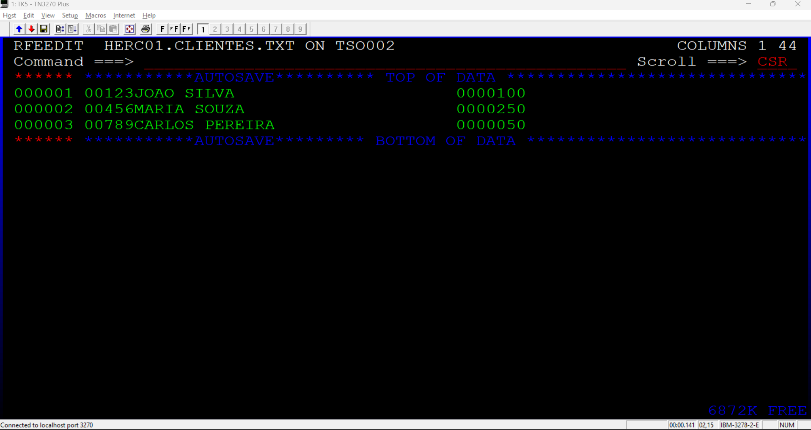
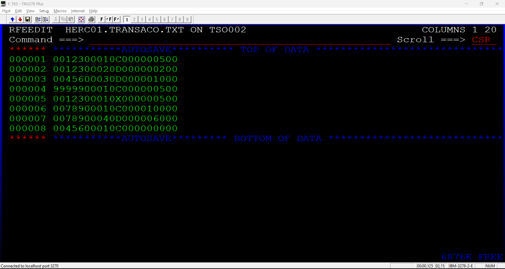

# Projeto 5: Sistema de Conciliação Bancária (Match/Merge em COBOL)

Este projeto consiste em um programa robusto em COBOL desenvolvido para o processamento em lote (batch) de conciliação bancária. O sistema realiza o cruzamento (*Match/Merge*) entre um arquivo mestre de clientes e um arquivo de transações diárias, processando créditos e débitos, aplicando regras estritas de negócio e gerando o saldo final atualizado.

## Funcionalidades
- **Ordenação Complexa (Duplo Critério)**: Utiliza JCL e utilitário SORT para organizar as transações por Cliente e por ID da Transação, garantindo a consistência cronológica (depósitos processados antes de saques na mesma remessa).
- **Conciliação e Atualização (Match/Merge)**: Sincroniza e cruza os dados do arquivo de clientes com os movimentos diários de forma sequencial.
- **Validação Estrita de Regras de Negócio**: Captura falhas e rejeita operações que não atendem aos critérios, incluindo:
  - Transações com valor zerado.
  - Tipos de transações inválidos (diferentes de 'C' ou 'D').
  - Saques rejeitados por saldo insuficiente.
  - Tratamento de Clientes Inexistentes (Prevenção de falso-positivo de fim de arquivo com uso de `HIGH-VALUES`).
- **Geração Múltipla de Relatórios**: Produz 4 arquivos de saída distintos (`CLIENTES_OUT.TXT`, `RELATOR.TXT`, `ERROS.TXT` e `ESTAT.TXT`) segregando saldos atualizados, históricos de movimentos, logs de rejeição e estatísticas de processamento.

## Tecnologias
- **Linguagem**: COBOL (OS/VS COBOL / ANSI 74)
- **Processamento**: JCL (Job Control Language) com utilitários IDCAMS (limpeza) e SORT
- **Ambiente**: Mainframe TK5 / TSO-ISPF / HERCULES

## Estrutura do Repositório
- `PROJBANC.cob`: Código fonte do programa COBOL contendo a lógica de processamento e validação.
- `PROJBANC.jcl`: JCL responsável por limpar execuções anteriores, ordenar os arquivos de entrada, compilar e executar o programa.
- `CLIENTES.TXT`: Arquivo mestre de clientes de entrada (ID, Nome, Saldo Inicial).
- `TRANSACO.TXT`: Arquivo de transações de entrada (ID do Cliente, ID da Transação, Tipo [C/D], Valor).
- `assets/`: Pasta contendo evidências visuais dos testes de mesa e resultados da execução.

## Como Executar
1. Certifique-se de que os arquivos de entrada (`CLIENTES.TXT` e `TRANSACO.TXT`) estão criados e populados no seu ambiente.
2. Acesse o editor de JCL no mainframe e submeta o job `PROJBANC.jcl` (comando `SUB`).
3. Verifique o Status (`ST`) da execução para garantir o *Return Code* de sucesso (`RC=0000` no step `GO`).
4. Os relatórios gerados estarão disponíveis nos respectivos datasets (`HERC01.CLIENTES.OUT`, `HERC01.RELATOR.TXT`, `HERC01.ERROS.TXT` e `HERC01.ESTAT.TXT`).

## Evidências de Execução
Abaixo, registros que comprovam o funcionamento correto do cruzamento de dados, tratamento de exceções (*Stress Test*) e estatísticas de processamento:

### 1. Arquivos de Entrada

### 2. Relatório: Saldos Atualizados (`CLIENTES.OUT`)

### 3. Relatório: Tratamento de Exceções (`ERROS.TXT`)

### 4. Relatório: Estatísticas e Movimentação (`ESTAT.TXT` / `RELATOR.TXT`)

### 5. Execução no Mainframe (Spool / JES2)

